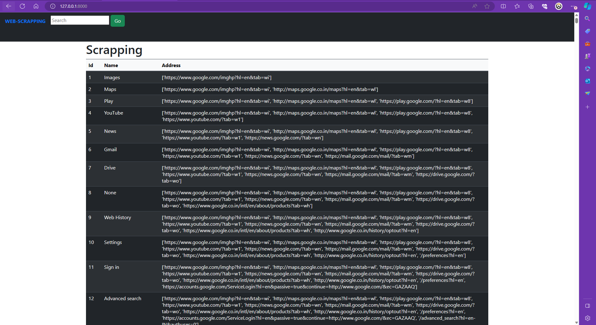

# Web Scraping Project (using python,django,html,css,bootstrap)

This project utilizes Python's web scraping libraries like BeautifulSoup and requests to extract information from web pages. 
The main objective is to collect data from various websites, process it, and store it in a structured format for further analysis or presentation.

# Key Features:

# Dynamic Web Scraping: 
The project employs dynamic web scraping techniques to navigate through web pages, extract relevant data, 
and handle different types of content such as text, links, images, etc.

# Data Processing: 
Extracted data is processed to remove noise, clean up inconsistencies, and organize it into a usable format.
This ensures that the collected information is accurate and consistent.

# Database Integration:
The project integrates with a database (e.g., SQLite, PostgreSQL) to store the scraped data efficiently. 
This allows for easy retrieval, manipulation, and analysis of the collected information.

# User Interface:
A user-friendly interface is provided to interact with the web scraping functionality. Users can input URLs 
or search queries, initiate the scraping process, and view the results in a structured manner.

# Scalability and Customization:
The project is designed to be scalable and customizable, allowing users to easily modify 
scraping parameters, add new sources, or extend functionality according to their requirements.

# Documentation and Examples:
Comprehensive documentation and examples are provided to help users understand the project
structure, usage, and best practices for web scraping. This ensures that users can quickly get started and effectively
utilize the project for their needs.

# Technologies Used

- Python
- HTML/CSS
- Bootstrap 

# Installation

# 1. Clone the repository:
   git clone https://github.com/yourusername/your-repository.git
   cd your-repository

# 2. Install dependencies:

pip install -r requirements.txt

# 3. Set up the database:

python manage.py migrate

# 4. Create a superuser:

python manage.py createsuperuser

# 5. Run the development server:

python manage.py runserver

# 6. Access the application:

 Open your web browser and go to http://localhost:8000/

# Usage
Navigate to http://localhost:8000/ to access the website.

# License
This project is licensed under the MIT License - see the LICENSE file for details.

# Contributing
Contributions are welcome! Please fork the repository and submit pull requests.
